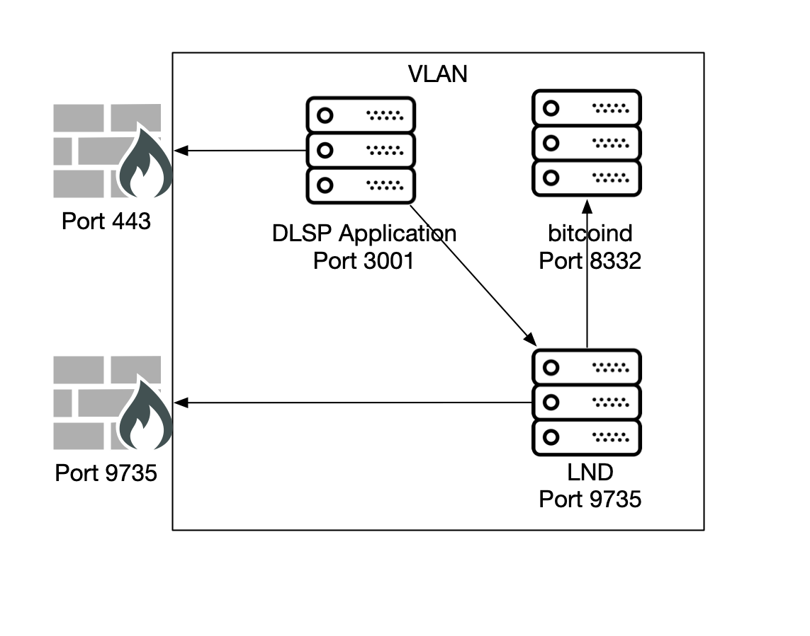

# plenny oracle

<!--
git clone \
  -c core.sshCommand="/usr/bin/ssh -o IdentitiesOnly=yes -i ~/.ssh/0xidm" \
  git@github.com:0xidm/0xidm.git

git config --local user.email "0xidm"
git config --local user.name "0xidm"
-->



Available make targets:

- `up`: use docker-compose to launch the container with environment settings
- `down`: shut down the container
- `container-shell-dev`: launch a shell inside the container
- `container-build`: build the container image from the Dockerfile
- `encrypt`: convert protected configuration to encrypted form
- `decrypt`: decrypt protected configuration to filesystem
- `unlock`: decrypt configuration and temporarily pipe to production host
- `push`: push the local repo to the remote host without git

## Installation

NB: for docker to work, the plenny user must have the same uid inside the container as on the host.  This ensures the FIFO can be written via ssh.

### Obtain PlennyOracle

You must first obtain the PlennyOracle software, which is currently in a closed beta.

Before building the Docker image, place the `.tar.gz` in the following location within this project:

`./files/PlennyOracle_Linux_x86_64-v3.0.0-Beta.tar.gz`

### Build Docker Image

`make container-build`

### Creating PlennyOracle env.ini

Obtain hex for use in configuration file.

```{bash}
xxd -p -c2000 ~/.lnd/data/chain/bitcoin/testnet/admin.macaroon
xxd -p -c2000 ~/.lnd/tls.cert
```

## Usage Notes

### Monitoring

```{bash}
ssh PLENNY_HOST
multitail \
  -l "docker container attach plenny-oracle" \
  /var/log/lnd-plenny.log \
  /var/log/bitcoind-testnet.log \
  -l "journalctl -f"
```

### Wallet setup

```{bash}
lncli-mainnet create
lncli-mainnet unlock
lncli-mainnet getinfo
lncli-mainnet newaddress np2wkh
```

## Encrypted configuration

### Prepare config

The configuration file inside the Docker image is available at:

`/home/plenny/.plenny-oracle/plenny-env.ini`

Locally, this file is located at one of the following:

- `/usr/local/src/plenny-oracle/config/plenny-env.ini`
- `/etc/plenny-oracle/plenny-env.ini`

Make this file a FIFO and decrypt the configuration to it:

```{bash}
mkfifo /etc/plenny-oracle/plenny-env.ini
decrypt /etc/plenny-oracle/plenny-env.ini.crypt > /etc/plenny-oracle/plenny-env.ini &
docker run plenny-oracle
```

### Use config

To actually invoke plenny with the decrypted password on nassau.

Step 1: decrypt the configuration and send to FIFO.  This is local, on dev laptop:

```{bash}
cd ~/Work/plenny-oracle
make unlock
```

Step 2: launch plenny container

```{bash}
sudo su
cd /etc/docker/plenny-oracle
docker-compose up
```

## Upgrading

### Obtain upgraded PlennyOracle tarball

https://github.com/PlennyPL2/Decentralized-Lightning-Service-Provider_DLSP/releases

Place the Plenny `.tar.gz` in the following location within this project:

`./files/PlennyOracle_Linux_x86_64-v3.X.X-Beta.tar.gz`

### Update version argument in dockerfile

Edit the following line:

`ARG PLENNY_VERSION=3.1.2-Beta`

### Push new state to production host

`make push`

### Build docker image

On production host:

```{bash}
cd /usr/local/src/plenny-oracle
make container-build
```

### Restart docker container

On dev host:

```{bash}
make unlock
```

On production host:

```{bash}
systemctl stop plenny-oracle
systemctl start plenny-oracle
```

## Debugging

Attach to docker container:

```{bash}
docker container attach plenny-oracle
```

Launch shell inside container:

```{bash}
cd /usr/local/src/plenny-oracle
make container-shell-prod
```
